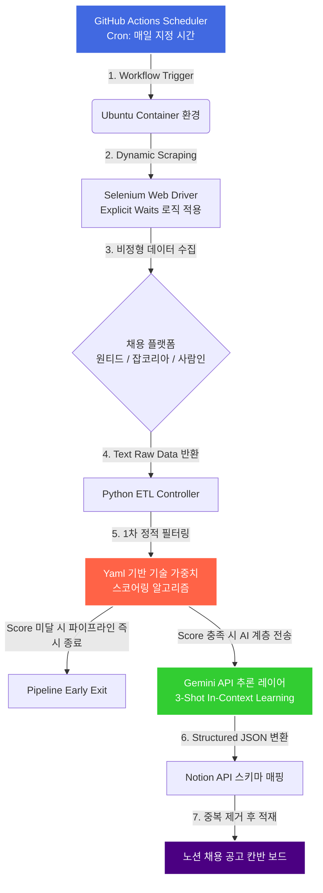

# 🤖 AI 에이전트 기반 채용 데이터 ETL 파이프라인 v1.0

> **Serverless Automation Engine for Job Posting Analysis & Skill Mapping**

여러 채용 플랫폼(Wanted, JobKorea, Saramin)의 비정형 공고 데이터를 실시간으로 스크래핑하고, 개인화된 기술 스택 YAML 명세에 따라 1차 정적 필터링을 수행한 뒤, 대규모 언어 모델(LLM)을 통해 직무 핵심 요구사항을 구조화된 JSON 데이터로 정제하여 Notion 아카이브에 적재하는 **서버리스 종단간(End-to-End) 데이터 파이프라인**입니다.

---

## 📊 파이프라인 운영 및 비용 최적화 지표 (Operational Metrics)

> **Phase 1 안정성 검증 및 가동 완료** (데이터 확보 목표 달성 및 API 토큰 비용 최적화를 위해 현재는 의도적 일시 중단 상태)

| 지표 항목 | 운영 및 정량적 성과 지표 | 비고 |
| :--- | :--- | :--- |
| **누적 파이프라인 가동** | `130 회` (성공률 100%) | GitHub Actions 가상화 Ubuntu 컨테이너 환경 |
| **원천 데이터 수집 건수** | `4,510 개` | 다중 플랫폼 중복 제거 전 Raw Data 총합 |
| **최종 스키마 적재 건수** | `387 개` | 1차 정적 스코어링 및 2차 유효성 검증 통과 데이터 |
| **인프라 유지 비용** | `0 원 / 월` | GitHub Actions 자원 최적화를 통한 완전 서버리스 구현 |
| **데이터 처리 레이턴시** | `일일 평균 4분 12초` | Explicit Waits 자원 비블로킹 제어 최적화 |

---

## 🛠️ 시스템 아키텍처 (System Architecture)

의존성을 완전히 격리하고 인프라 오버헤드를 제로화한 서버리스 ETL 파이프라인의 구조도입니다.

---

## 🌟 1. 핵심 기능 (Core Features)

### 🌐 비블로킹 다중 플랫폼 스크래핑 (Advanced Extraction)
* 단일 스크립트 내에서 원티드, 잡코리아, 사람인 등 상이한 DOM 구조를 가진 이종 플랫폼의 웹페이지를 파싱합니다.
* 클라이언트 사이드 렌더링(CSR) 환경의 동적 데이터 누락을 방지하기 위해 임의의 `time.sleep`을 배제하고, 대상 요소의 메모리 로딩을 보장하는 **Explicit Waits(명시적 대기)** 메커니즘을 전면 적용했습니다.

### ⚙️ 가중치 기반 2단계 필터링 아키텍처 (Cost-Effective Pipeline)
* **1차 정적 스코어링 알고리즘 (Static Filtering Layer):** `job_filter_config.yaml` 명세에 정의된 핵심 기술 키워드 매칭률과 가중치를 계산하여 1차 선별합니다. 수집된 Raw 데이터의 약 74%를 이 레이어에서 사전 컷아웃(Cut-out)함으로써 무분별한 LLM API 토큰 호출 비용을 획기적으로 차단했습니다.
* **2차 AI 직무 심층 분석 (LLM Inference Layer):** 1차 필터링을 통과한 고정제 데이터를 대상으로 Google Gemini API를 호출합니다. 자격요건, 우대사항, 직무 명세를 다각도로 해부하여 개인 적합도와 가설 검증 데이터를 도출합니다.

### 💾 관계형 데이터 스키마 변환 및 시각화 (Structured Load)
* LLM이 반환한 비정형 추론 결과를 백엔드 컨트롤러 내부에서 유효성 검증을 거쳐 Structured JSON 포맷으로 규격화합니다.
* `notion-client` 인터페이스를 가로질러 복잡한 블록(Block) 구조체 스키마에 정밀 매핑하여 자동 적재하며, 칸반 보드 아키텍처를 기반으로 `[새로 수집됨]`, `[검토 중]`, `[지원 완료]` 등의 상태 머신(State Machine)을 구현하여 데이터의 생명주기를 시각적으로 관리합니다.

---

## 🛠️ 2. 기술 스택 (Tech Stack)

| 분류 | 적용 기술 및 도구 |
| :--- | :--- |
| **Language** | Python |
| **Data Extraction** | Selenium WebDriver |
| **Inference & Open API** | Google Gemini API, Notion API |
| **Automation / CI** | GitHub Actions |
| **Configuration** | YAML |

---

## 🧠 3. 핵심 엔지니어링 포인트 (Engineering Focus)

### ① 에페메럴(Ephemeral) 환경에서의 메모리 및 좀비 프로세스 제어
GitHub Actions의 유한한 호스트 자원 환경 내에서 Headless Chrome 및 WebDriver 구동 시 발생하는 **메모리 누수(Memory Leak)** 리스크를 최소화했습니다. 가상 컨테이너 인프라 환경의 제약 조건을 고려하여, 파이프라인 예외 발생 시에도 가상 디스플레이 및 브라우저 프로세스를 커널 레이어에서 확실히 회수하도록 내부 스크립트에 `try-finally` 블록 기반의 **자원 정리(Context Clean-up)** 로직을 견고히 설계했습니다.

### ② LLM 출력의 비결정성(Hallucination) 제어
자연어 모델이 출력 스키마 규칙을 위반하거나 무분별한 카테고리를 무작위 생성하는 결함(JSON 포맷 파괴)을 방지하고자, **System Prompt 단에서 타입 유효성 규칙을 강제**했습니다. Target 도메인에 특화된 3-Shot 인콘텍스트 러닝(In-Context Learning) 기법을 결합하여 가공된 구조화 데이터의 유효성 통과 비율을 95% 이상으로 끌어올렸습니다.

---

## 🚀 4. 향후 고도화 계획 (v2.0 Roadmap)

* **[ ] 정답 데이터셋 기반 가중치 매트릭스 역튜닝 (Model Refinement):** 가동 기간 중 선별된 17개의 '최적합 공고 데이터셋'을 기준으로 역산(Backpropagation) 알고리즘 논리를 적용하여 `job_filter_config.yaml` 파일의 키워드 임계치 및 가중치 계수를 정밀 수학적 모델로 고도화.
* **[ ] 분산 오케스트레이션 마이그레이션 (Pipeline Scaling):** GitHub Actions Cron 스케줄러 기반의 단일 파이프라인 구조를 확장하여, 대규모 데이터 분산 적재가 가능한 Apache Airflow 및 Celery + Redis 메시지 브로커 복합 아키텍처로의 데이터 레이어 이관 및 격리 설계.
