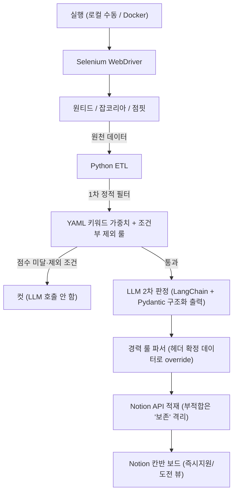

# 채용공고 자동 분석 파이프라인 (web-crawler)

> 매주 채용공고 검토에 쓰던 3~4시간의 수작업을 없애기 위해 만든 개인용 ETL 파이프라인.
> 3개 채용 플랫폼의 공고를 수집해, 개인 기술 스택 기준으로 1차 필터링하고, LLM으로 적합도를 판정해 Notion 칸반에 정리한다.

---

## 프로젝트 동기

구직 활동 중, 매주 다음 작업을 수작업으로 반복했다.

- 여러 플랫폼의 새 공고 확인
- 내 스택과 안 맞는 공고 거르기 (예: 백엔드여도 Java/Spring 단독 요구)
- 적합도 판단 후 정리

여기에 매주 3~4시간이 들었다. 이 반복을 자동화하려고 수집·필터·판정·적재를 파이프라인으로 묶었다.
포트폴리오용 토이 프로젝트가 아니라, 실제 내 병목을 푸는 도구로 시작했고 지금도 그 목적으로 운영한다.

---

## v1 → 고도화에서 달라진 것

v1은 "매주 공고 검토 시간을 줄인다"는 1차 목표를 달성했지만, 운영하면서 확인한 한계를 고도화에서 해소했다.

| v1의 한계 | 고도화 결과 |
| :--- | :--- |
| 1차 필터가 가중치 합산 위주라 Java/Spring 단독 공고를 못 걸렀고, 반대로 우대사항의 "프론트엔드" 한 줄에 백엔드 공고가 오탈락했다 | 조건부 제외 룰(핵심 스택 부재 + 특정 생태계 요구 시에만 컷)로 재편 — 두 방향의 오류를 모두 차단 |
| 수집 플랫폼이 원티드·잡코리아·사람인 | 사람인을 점핏(개발자 특화)으로 교체 — 신입 백엔드 커버리지 기준으로 플랫폼별 실측 후 확정 |
| 2차 판정이 자유 텍스트라 적재 후에도 수동 판단이 남았다 | Pydantic 구조화 출력으로 경력요건·매칭도·적합도·지원 이력서 버전·우선순위·판정근거를 필드 단위 판정, Notion 속성으로 분리 적재 |
| LLM 판정을 그대로 신뢰해 오판 시 추적 불가 | 확정 가능한 정보(공고 헤더의 경력 표기)는 정규식 룰 파서가 LLM 판정을 덮어쓰고, 부적합 판정은 삭제가 아닌 '보존' 격리로 적재해 사람이 검수 가능하게 설계 |
| 로컬과 실행 환경이 갈렸다 | Docker 컨테이너화 + 의존성 버전 핀 고정으로 재현성 확보 |

각 개선은 모두 "매주 수작업을 더 줄인다"는 본래 목적에 직접 연결된다.
개선 과정의 시행착오는 [docs/TROUBLESHOOTING.md](docs/TROUBLESHOOTING.md)에 8건의 사례로 기록했다
(URL 파라미터 실측 규명, LLM 지시 준수율 위계, 의존성 미고정으로 인한 환경 분화 등).

---

## 시스템 구조

- LLM은 용도별 이원화: 대량 백필은 NVIDIA NIM(Qwen3.5, 40 RPM), 일일 운영은 Gemini 2.5 Flash(무료 티어) — 환경변수 한 줄로 전환.
- GitHub Actions cron 자동화는 구축 완료 상태이나, 데이터센터 IP에 대한 플랫폼 측 봇 차단(CloudFront 403) 이슈로 스케줄 가동은 보류 중 — 현재는 로컬 실행으로 운영하며, 차단 대응은 2단계 과제.

---

## 핵심 기능

### 다중 플랫폼 수집
- 원티드·잡코리아·점핏 3개 플랫폼. UI 조작 대신 **URL 파라미터 직접 주입**으로 직군·경력·지역 필터를 서버에 위임한다
  (필터 파라미터는 추측이 아니라 개발자도구 네트워크 탭 실측으로 규명 — 예: 잡코리아 `careerTypeCode`, 필터 적용 여부는 서버 totalcount 대조로 정량 검증).
- 잡코리아 상세 페이지의 iframe은 ID 고정이 아닌 동적 열거로 탐지하고, iframe이 없는 유형은 body 폴백으로 이중 대응.
- 장시간 배치 중 드라이버 세션이 죽으면(`invalid session id`) 감지 즉시 재생성 후 해당 건을 재시도한다.

### 2단계 필터 (LLM 호출 비용 절감)
- **1차 (정적):** `job_filter_config.yaml`의 키워드 가중치 + 조건부 제외 룰.
  절대 제외는 최소화하고, "핵심 스택(Python 계열) 부재 + 타 생태계(Java/Node/프론트) 요구"의 조합일 때만 컷해
  우대사항에 스치듯 등장하는 기술명으로 인한 오탈락을 방지한다. 탈락 시 사유(발동 키워드)를 로그로 남긴다.
- **2차 (LLM):** 1차 통과분만 LLM을 호출한다. 백필 실측 기준 수집분의 약 56%가 1차에서 컷되어 그만큼의 LLM 호출을 절약했다.

### LLM 구조화 판정 (LangChain + Pydantic)
공고별로 다음을 Pydantic 스키마로 강제된 구조화 출력으로 판정한다.

- **경력요건** (신입/1~2년/3년이상/경력무관, 복수 선택) — "경력무관"과 "경력(연수무관)"의 정반대 의미까지 구분하는 판정 규칙 명시
- **매칭도** (상/중/하) — 보유 비율뿐 아니라 "결여된 기술이 직무의 핵심인가"를 우선 판정 (C/C++ 엔진 개발에 Python이 보조로 붙은 공고를 '하'로 정확히 분류)
- **적합도** (0~10, Pydantic `ge/le` 하드 제약 + 단계별 앵커)
- **지원 이력서 버전** (A: 백엔드 / B: AI), **우선순위** (즉시지원/도전/보존), **판정근거** (검수용 한국어 논증)

판정 규칙은 실측으로 확인한 준수율 위계에 따라 배치했다:
핵심 규칙은 시스템 프롬프트(Judgment Guidelines)에, 값의 형식·범위는 Pydantic 제약에, 필드 설명은 보조 방어선에.

### 판정 신뢰성 장치
- **룰 우선 override:** 공고 헤더의 구조화된 경력 표기(예: "경력 1-3년")는 정규식 파서가 결정적으로 파싱해 LLM 판정을 덮어쓴다. 확률적 판단은 비정형 텍스트에만 개입시킨다.
- **비가역 삭제 금지:** LLM이 '부적합'으로 판정해도 삭제하지 않고 '보존'으로 격리 적재한다. 판정근거가 Notion에 남아 오판을 사람이 발견·교정할 수 있고, 적재 기록 자체가 중복 재분석을 막는 장부 역할을 한다.
- **재시도·복구:** 일시적 장애(5xx·타임아웃)는 tenacity 지수 백오프로 재시도하고, 최종 실패 건은 다음 실행에서 자동 재처리된다(중복 확인 구조의 부수 효과).

### Notion 적재
판정 결과를 속성 단위로 분리 적재해 필터·정렬이 가능하다.
AI가 판정하는 속성(우선순위·매칭도·적합도)과 사람이 관리하는 상태(새로 수집됨/검토중/완료)를 분리해,
"AI는 추천, 결정은 사람"의 경계를 보드 구조에 반영했다. 부적합 격리분은 뷰 필터로 시야에서 제외하되 데이터는 보존한다.

---

## 기술 스택

| 분류 | 도구 |
| :--- | :--- |
| 언어 | Python |
| 수집 | Selenium WebDriver |
| LLM 파이프라인 | LangChain, Pydantic (구조화 출력), Google Gemini 2.5 Flash, NVIDIA NIM (Qwen3.5) |
| 연동 | Notion API |
| 실행 환경 | Docker, GitHub Actions |
| 설정 | YAML, dotenv |

---

## 운영 지표

> 실행 로그 기준. 측정 근거가 확인된 항목만 기재한다.

| 항목 | v1 누적 | 고도화 백필 (2026-07) |
| :--- | :--- | :--- |
| 원천 수집 | 4,510건 | 949건 (3개 플랫폼) |
| 1차 필터 컷 | 약 91% | 약 56% (534건 — 조건부 룰 재편으로 오탈락 감소분 반영) |
| LLM 판정 | — | 약 410회 (구조화 출력 성공률 98% 이상, 실패분은 재실행 자동 재처리) |
| 최종 적재 | 387건 | 407건 (판정 4필드·근거 포함, 그중 부적합 격리 약 1/3) |
| 파이프라인 에러율 | — | 0.8% (949건 중 8건, 전량 재처리 가능 상태로 종료) |
| 인프라 비용 | 월 0원 | 월 0원 (무료 티어 조합) |

---

## 진행 상태

- **v1 가동 완료:** 3개 플랫폼 수집 → 2단계 필터 → LLM 판정 → Notion 적재의 전체 사슬 검증
- **1단계 고도화 완료 (2026-07):** 크롤러 전수 재검증·점핏 교체, 조건부 제외 룰, Pydantic 구조화 판정 + 룰 파서 + 격리 설계, LLM 이원화, Docker 재현성(의존성 핀), 3개 플랫폼 949건 백필
- **현재:** 일일 운영 중 (로컬 실행, Gemini 모드) — 운영 데이터 기반으로 판정 품질을 주기 검수

---

## 향후 계획 (2단계 — 구조 고도화)

- SQLAlchemy + PostgreSQL 원장 전환 (Notion은 뷰로) — 탈락 사유·실행 이력 적재
- 판정 품질 평가 하니스 (골든셋 기반, 프롬프트 버전별 정확도 추적)
- 중복 확인 최적화 (건별 쿼리 → 전체 링크 1회 로드 + set 대조)
- LangGraph 오케스트레이션 (조건부 엣지·재시도·reflection 노드)
- 테스트 + CI 품질 게이트 (pytest / ruff / mypy)
- GHA 스케줄 재가동 (봇 차단 대응 후), 실행 알림 (Slack/Telegram)
