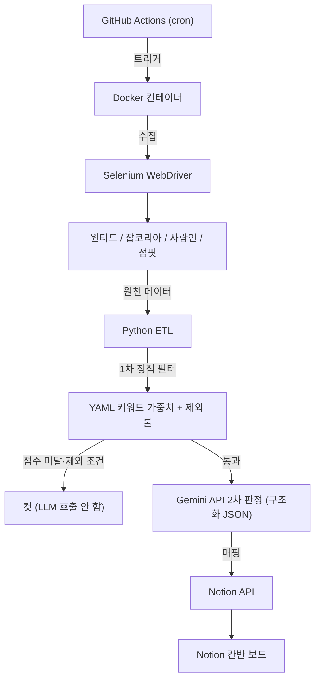

# 채용공고 자동 분석 파이프라인 (web-crawler)

> 매주 채용공고 검토에 쓰던 2~3시간의 수작업을 없애기 위해 만든 개인용 ETL 파이프라인.
> 여러 채용 플랫폼의 공고를 수집해, 개인 기술 스택 기준으로 1차 필터링하고, LLM으로 적합도를 판정해 Notion에 정리한다.

---

## 프로젝트 동기

구직 활동 중, 매주 다음 작업을 수작업으로 반복했다.

- 여러 플랫폼의 새 공고 확인
- 내 스택과 안 맞는 공고 거르기 (예: 백엔드여도 Java/Spring 단독 요구)
- 기업 정보·평판 확인
- 적합도 판단 후 정리

여기에 매주 2~3시간이 들었다. 이 반복을 자동화하려고 수집·필터·판정·적재를 파이프라인으로 묶었다.
포트폴리오용 토이 프로젝트가 아니라, 실제 내 병목을 푸는 도구로 시작했다.

---

## 개선 동기 (v1 → 고도화)

v1은 "매주 공고 검토 시간을 줄인다"는 1차 목표는 달성했지만, 운영하면서 다음 한계를 확인했고 각각을 개선 중이다.

| v1의 한계 | 개선 방향 | 기대 효과 |
| :--- | :--- | :--- |
| 1차 필터가 가중치 합산 위주라, "백엔드"여도 Java/Spring 단독 요구 공고를 충분히 못 걸렀다 | 조건부 제외 룰 추가 (핵심 스택 부재 + 특정 언어 요구 시 컷) | 무관 공고가 적재 단계까지 새는 걸 차단 |
| 수집 플랫폼이 원티드·잡코리아·사람인으로 한정 | 점핏 추가 | 신입 백엔드 공고 커버리지 확대 |
| 2차 분석이 적합도를 충분히 구조화하지 못해 적재 후에도 수동 판단이 남았다 | 경력 적합·매칭도·지원 버전·분류를 자동 판정 | 적재된 공고를 바로 행동(지원/보류)으로 연결 |
| GitHub Actions 러너에 의존해 로컬과 실행 환경이 갈렸다 | Docker 컨테이너화 | 환경 재현성 확보, 어디서나 동일 실행 |

각 개선은 모두 "매주 수작업을 더 줄인다"는 본래 목적에 직접 연결된다.
구조적 고도화(DB·오케스트레이션·테스트·정확도 평가)는 메인 프로젝트 완성 후 별도로 진행한다(아래 2단계).

---

## 시스템 구조

---

## 핵심 기능

### 다중 플랫폼 수집
- 원티드·잡코리아·사람인·점핏의 공고를 Selenium으로 수집한다.
- 동적 로딩 요소는 `time.sleep` 대신 명시적 대기(`WebDriverWait`)로 처리한다.
- 예외가 나도 브라우저 프로세스를 회수하도록 `try-finally`로 정리한다.

### 2단계 필터 (LLM 호출 비용 절감)
- **1차 (정적):** `job_filter_config.yaml`의 키워드 가중치와 제외 룰로 선별한다.
  수집분의 상당 부분을 이 단계에서 컷해 불필요한 LLM 호출을 막는다.
- **2차 (LLM):** 1차를 통과한 공고만 Gemini를 호출해 자격요건·우대사항·직무를 해석한다.

### Gemini 구조화 판정
공고별로 다음을 구조화 JSON으로 판정한다.
- 경력요건이 신입~2년에 해당하는가
- 요구기술이 내 스택(Python / FastAPI / LLM / 크롤링 / 비동기)과 얼마나 맞는가 — 상 / 중 / 하
- 이력서 A(백엔드)·B(AI) 중 어느 쪽으로 지원할지
- 즉시지원 / 도전 / 보존 분류

출력 형식은 시스템 프롬프트로 스키마를 강제하고, few-shot 예시를 함께 제공해 안정화한다.

### Notion 적재
판정 결과(매칭도·버전·분류)를 Notion 칸반의 속성으로 기록하고,
상태(새로수집 / 검토중 / 지원완료)로 공고의 생명주기를 관리한다.

---

## 기술 스택

| 분류 | 도구 |
| :--- | :--- |
| 언어 | Python |
| 수집 | Selenium WebDriver |
| 추론 · 연동 | Google Gemini API, Notion API |
| 자동화 | GitHub Actions (cron) |
| 실행 환경 | Docker |
| 설정 | YAML |

---

## 운영 지표

> 가동 로그 기준. 측정 근거가 확인된 항목만 기재하며, 미검증 수치는 비워둔다.

| 항목 | 값 |
| :--- | :--- |
| 누적 가동 횟수 | _(로그로 확정 필요)_ |
| 원천 수집 건수 | 4,510건 (중복 제거 전) |
| 최종 적재 건수 | 387건 |
| 1차 필터 컷 비율 | 약 91% |
| 인프라 비용 | 월 0원 (GitHub Actions 무료 한도 내) |

---

## 진행 상태

- **가동 완료:** 원티드·잡코리아·사람인 수집, 2단계 필터, Gemini 판정, Notion 적재 (데이터 확보 목표 달성으로 의도적 일시 중단)
- **1단계 고도화 (진행 중):** 조건부 제외 룰, 점핏 수집, 판정 항목 확장, Notion 속성 개편, Docker 컨테이너화

---

## 향후 계획

**1단계 (진행 중) — 병목 해소**
- 무관 공고 자동 제외 (YAML 제외·조건부 룰)
- 점핏 플랫폼 수집 추가
- Gemini 판정 항목 추가 (경력 적합 / 매칭도 / 지원 버전 / 분류)
- Notion 적재 구조 개편
- Docker 컨테이너화

**2단계 (예정) — 구조 고도화**
- SQLAlchemy + PostgreSQL (Docker Compose)
- LangGraph 오케스트레이션 (조건부 엣지·재시도)
- 경계 케이스 검증(reflection) 노드
- 테스트 + CI 품질 게이트 (ruff / mypy / pytest)
- 1차 필터 정확도 평가(precision/recall)
- Playwright 마이그레이션 검토
